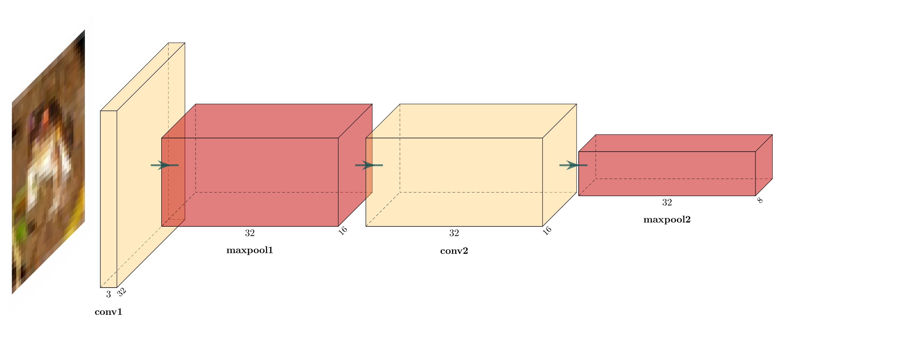

# FirstCNN
My initial CNN for classifying CIFAR-10 data.

Contains 2 convolutional layers and one fully-connected layer.

Final accuracy after 100 epochs: 61.5% (random guessing = 10%)

The block diagram for the model is shown below.

